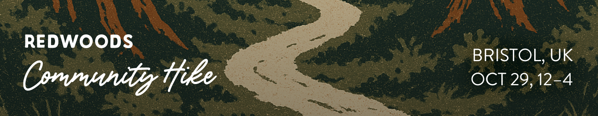

**Redwoods is Bristol-Bound!**

Quite a few Redwoods members will be making the journey to Bristol this October to speak at and/or attend [zeroheight](https://zeroheight.com/)'s premier design system event: [Converge](https://ti.to/zeroheight/converge-2025/discount/REDWOODS-W10).

Ben will be giving a workshop the day after the keynotes (Friday, October 31) on how to assess your organization's culture and what to do with that information. Here's the rundown.

> ## Design System Culture Mapping: Turning Resistance Into Momentum
>
> If you've ever felt like you're swimming against the current of your organization, this workshop is for you.
>
> Design systems are much more than tokens, components and code libraries. While the technical and creative assets are essential, there's an often overlooked force that shapes their success: culture.
>
> Whether it's the culture of your broader organization or the subculture within your design system team, the relationship between the two has a direct impact on how your system is built, adopted, and sustained. When these cultural forces are misaligned, even the most well-crafted systems struggle to gain traction.
>
> This full-day workshop will pull back the curtain on how culture impacts a design system program, and give you the tools to assess and adapt your approach accordingly.

*[Read more about the workshop >](https://converge.zeroheight.com/workshop/)*

## Other members attending

Quite a few other folks are attending, including Robin, Lauren, Dan, ToniAnn, Shaun, Ness, Ron, Kacey, Christian, and likely a few others! Because so many of us will be in one place, we're planning something really fun...

## Redwoods Community Hike

We've discovered that there is a small stand of Coastal Redwoods trees just outside of Bristol. Logically, we're planning a community hike to see these trees! Here are the details:

- Date: October 29, 2025
- Time: Noon to 4pm
- Location: [Ashton Hill](https://www.google.com/maps/place/Ashton+Hill+Plantation/@51.4361426,-2.6962487,17z/data=!4m7!3m6!1s0x4871f3ca627ac477:0x678210d2050d4e6f!4b1!8m2!3d51.4361426!4d-2.6936738!16s%2Fg%2F11fn6mgn8t?entry=ttu&g_ep=EgoyMDI1MDcxMy4wIKXMDSoASAFQAw%3D%3D)

We'll meet at the [Clayton Hotel](https://www.hotelsone.com/bristol-hotels-gb/clayton-hotel-bristol-city.html) at Noon, head to lunch together, then to Ashton Hill for the hike, and return to the hotel by 4pm.

We've got some transportation planned, but we have limited space on the bus and at the lunch spot.

*[You can RSVP for the hike here >](https://bit.ly/redwoodsHike-oct25)*

See you in Bristol!
